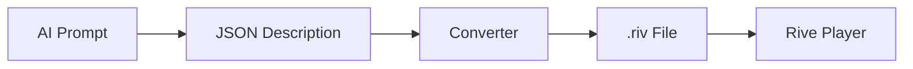

# 🎬 JSON to RIV Converter

AI ile doğal dil kullanarak Rive animasyonları oluşturmak için **JSON → .riv** converter'ı.

## 🎯 Genel Bakış

Bu proje, AI dil modellerinin üretebileceği JSON formatındaki animasyon tanımlarını Rive'ın binary `.riv` formatına dönüştürür. 



### Özellikler
- ✅ **JSON Schema**: Basit ve anlaşılır animasyon tanımı
- ✅ **Shape Support**: Rectangle, Ellipse desteği  
- ✅ **Animation System**: Keyframe-based animasyonlar
- ✅ **Cross-platform**: Windows, macOS, Linux
- ✅ **AI-Ready**: GPT/Claude entegrasyonu için hazır

## 🚀 Hızlı Başlangıç

### Gereksinimler
- **CMake** 3.16+
- **C++17** compiler (Clang/GCC/MSVC)
- **Git** (dependencies için)

### Kurulum

**Linux/macOS:**
```bash
# Repository'yi klonlayın
git clone https://github.com/rive-app/rive-runtime.git
cd rive-runtime

# Converter dosyalarını ekleyin (bu dosyalar)
# Ardından build edin
chmod +x build_converter.sh
./build_converter.sh
```

**Windows:**
```cmd
REM Repository'yi klonlayın  
git clone https://github.com/rive-app/rive-runtime.git
cd rive-runtime

REM Converter dosyalarını ekleyin (bu dosyalar)
REM Ardından build edin
build_converter.bat
```

### İlk Test
```bash
cd build_converter
./simple_demo
```

## 📋 JSON Schema

### Temel Yapı
```json
{
  "artboard": {
    "name": "MyAnimation", 
    "width": 400,
    "height": 600,
    "backgroundColor": "#87CEEB",
    "clip": true
  },
  "objects": [...],
  "animations": [...]
}
```

### Desteklenen Objeler

**Rectangle:**
```json
{
  "type": "rectangle",
  "name": "myRect",
  "id": 1,
  "x": 100, "y": 100,
  "width": 50, "height": 50,
  "fill": {"type": "solid", "color": "#FF0000"}
}
```

**Ellipse:**
```json
{
  "type": "ellipse", 
  "name": "myCircle",
  "id": 2,
  "x": 200, "y": 200,
  "width": 60, "height": 60,
  "stroke": {"color": "#0000FF", "thickness": 3}
}
```

### Animasyon Sistemi

**Keyframe Animation:**
```json
{
  "name": "bounce",
  "duration": 2.0,
  "fps": 60,
  "loop": true,
  "keyframes": [
    {
      "objectId": 1,
      "property": "y", 
      "keyframes": [
        {"time": 0.0, "value": 100, "interpolationType": "cubic"},
        {"time": 1.0, "value": 400, "interpolationType": "cubic"},
        {"time": 2.0, "value": 100, "interpolationType": "cubic"}
      ]
    }
  ]
}
```

**Desteklenen Properties:**
- `x`, `y` - Position
- `scaleX`, `scaleY` - Scale
- `rotation` - Rotation (degrees)
- `opacity` - Transparency

**Interpolation Types:**
- `linear` - Doğrusal
- `cubic` - Easing ile

## 🛠️ Kullanım Örnekleri

### 1. Komut Satırı Kullanımı
```bash
# JSON dosyasını RIV'e çevir
./test_converter input.json output.riv

# Örnek dosyayı test et
./test_converter bouncing_ball.json my_animation.riv
```

### 2. C++ API Kullanımı
```cpp
#include "json_to_riv_converter.hpp"

JsonToRivConverter converter;
std::string jsonContent = readJsonFile("animation.json");
bool success = converter.convertJsonToRiv(jsonContent, "output.riv");
```

### 3. AI Entegrasyonu (Python Örneği)
```python
import openai
import subprocess
import json

class RiveAIGenerator:
    def generate_animation(self, prompt):
        # AI'dan JSON al
        response = openai.Completion.create(
            engine="gpt-4",
            prompt=f"Create a Rive animation JSON for: {prompt}",
            max_tokens=1000
        )
        
        # JSON'ı dosyaya yaz
        with open("temp.json", "w") as f:
            json.dump(response.choices[0].text, f)
        
        # Converter'ı çağır
        result = subprocess.run([
            "./test_converter", "temp.json", "output.riv"
        ], capture_output=True)
        
        return result.returncode == 0

# Kullanım
generator = RiveAIGenerator()
generator.generate_animation("zıplayan mavi top")
```

## 🎨 Örnekler

### Basit Zıplayan Top
```json
{
  "artboard": {
    "name": "BouncingBall",
    "width": 400,
    "height": 600,
    "backgroundColor": "#E0F6FF"
  },
  "objects": [
    {
      "type": "ellipse",
      "name": "ball", 
      "id": 1,
      "x": 200, "y": 100,
      "width": 50, "height": 50,
      "fill": {"type": "solid", "color": "#FF4444"}
    }
  ],
  "animations": [
    {
      "name": "bounce",
      "duration": 2.0,
      "loop": true,
      "keyframes": [
        {
          "objectId": 1,
          "property": "y",
          "keyframes": [
            {"time": 0.0, "value": 100},
            {"time": 1.0, "value": 500},
            {"time": 2.0, "value": 100}
          ]
        }
      ]
    }
  ]
}
```

### Dönen Kare
```json
{
  "artboard": {"name": "SpinningSquare", "width": 300, "height": 300},
  "objects": [
    {
      "type": "rectangle",
      "name": "square",
      "id": 1, 
      "x": 125, "y": 125,
      "width": 50, "height": 50,
      "fill": {"type": "solid", "color": "#00FF00"}
    }
  ],
  "animations": [
    {
      "name": "spin",
      "duration": 3.0,
      "loop": true,
      "keyframes": [
        {
          "objectId": 1,
          "property": "rotation", 
          "keyframes": [
            {"time": 0.0, "value": 0},
            {"time": 3.0, "value": 360}
          ]
        }
      ]
    }
  ]
}
```

## 🔧 Gelişmiş Kullanım

### Custom AI Prompts
AI modelinizi eğitirken şu şablon promptları kullanabilirsiniz:

```
"Rive animasyon JSON'u oluştur: [AÇIKLAMA]

JSON formatı:
- artboard: boyut ve arka plan
- objects: şekiller ve özellikler  
- animations: keyframe'ler ve timing

Örnek çıktı: {...}
"
```

### n8n Workflow Entegrasyonu
```javascript
// n8n Custom Node örneği
const description = $input.first().json.animationPrompt;

// AI API çağrısı
const aiResponse = await fetch('https://api.openai.com/v1/completions', {
  method: 'POST',
  headers: { 'Authorization': 'Bearer ' + $env.OPENAI_API_KEY },
  body: JSON.stringify({
    model: 'gpt-4',
    prompt: `Create Rive JSON: ${description}`,
    max_tokens: 1000
  })
});

// JSON'ı converter'a gönder
const converterResponse = await fetch('/api/convert-to-riv', {
  method: 'POST', 
  body: aiResponse.choices[0].text
});

return { rivFile: converterResponse.body };
```

## 📊 Sınırlamalar ve Bilinen Sorunlar

### Mevcut Sınırlamalar
- ❌ **Complex Shapes**: Sadece rectangle ve ellipse desteklenir
- ❌ **Advanced Animations**: Bezier curves, morph animations desteklenmez  
- ❌ **Text Objects**: Text rendering henüz desteklenmez
- ❌ **Images**: Bitmap image import desteklenmez
- ❌ **State Machines**: Sadece linear animasyonlar

### Gelecek Özellikler
- 🔄 **Path Support**: SVG path import
- 🔄 **Text Rendering**: Dynamic text animations
- 🔄 **Image Handling**: Asset management
- 🔄 **State Machines**: Interactive animations
- 🔄 **Gradient Fills**: Advanced paint systems

## 🤝 Katkıda Bulunma

### Geliştirme Ortamı
```bash
# Debug build
./build_converter.sh --debug --clean

# Test suite çalıştır  
cd build_converter
./test_converter bouncing_ball.json test_output.riv

# Verbose output
./build_converter.sh --verbose
```

### Yeni Özellik Ekleme
1. `json_to_riv_converter.hpp` - Header'a declarations ekleyin
2. `json_to_riv_converter.cpp` - Implementation ekleyin
3. `test_converter.cpp` - Test case ekleyin
4. `simple_demo.cpp` - Demo güncelle

## 📖 Referanslar

- **Rive Runtime**: https://github.com/rive-app/rive-runtime
- **JSON for Modern C++**: https://github.com/nlohmann/json  
- **Rive Documentation**: https://help.rive.app/
- **Animation Principles**: https://en.wikipedia.org/wiki/12_basic_principles_of_animation

## 📄 License

Bu proje MIT License altında lisanslanmıştır. Detaylar için [LICENSE](LICENSE) dosyasına bakın.

---

## 🎉 Sonuç

Bu converter ile artık AI dil modellerinden aldığınız doğal dil talimatlarını Rive animasyonlarına dönüştürebilirsiniz!

**Workflow**: `"Zıplayan kırmızı top animasyonu yap"` → AI → JSON → Converter → `animation.riv`

Sorularınız için issue açabilir veya doğrudan iletişime geçebilirsiniz. 🚀
